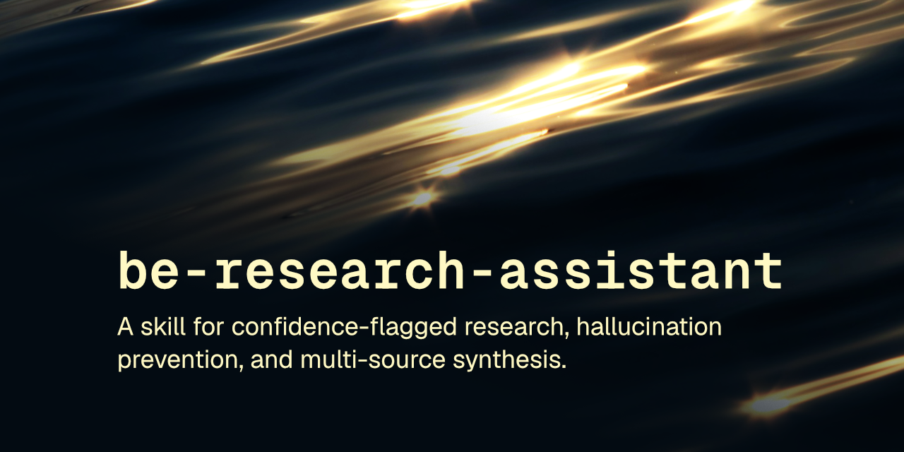

<p align="center"></p>

# delve

Research skill flags confidence, kills hallucination, cites source. No auto-invoke, on purpose.

[](LICENSE) [](https://skills.sh/robcsaszar/delve)

A skill that activates a rigorous research collaborator mode: it flags confidence levels on every claim, resists constructing plausible-sounding but unverified answers, cites sources, and surfaces the assumptions behind a conclusion instead of stating it flatly.

This skill follows the [Agent Skills specification](https://agentskills.io/specification) so it can be used by any skills-compatible agent.

## Installation

### npx skills

```
npx skills add robcsaszar/delve
```

### Marketplace

```
/plugin marketplace add robcsaszar/delve
/plugin install robcsaszar-delve@delve
```

### Manually

Copy the `skills/` directory into your project's `.claude/skills/`.

## The skill

`delve` turns the agent into a research collaborator rather than an answer machine. It marks every claim with a confidence level (**[high]**, **[medium]**, **[low/uncertain]**, or **[outside my reliable knowledge]**), distinguishes direct knowledge from analogy, simplification, and speculation, and says so explicitly when it's uncertain instead of filling the gap with something that merely sounds right. It's meant for investigating a claim, exploring a technical concept, or working through multiple sources at once, not for quick factual lookups you just want answered directly (it disables model auto-invocation for that reason: invoke it deliberately).

## License

[MIT](LICENSE) © Rob Csaszar
